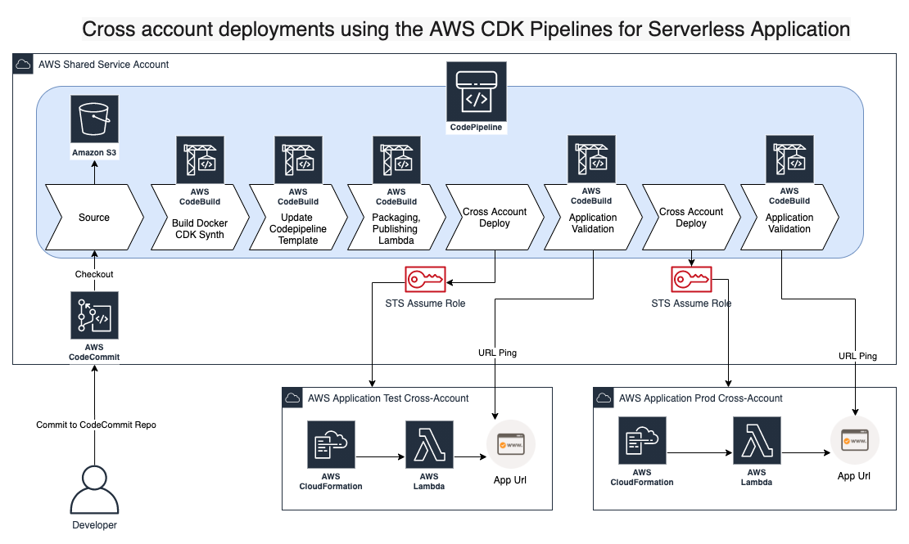

# Package Description:

The purpose of this artifact is to give a customer out of the box solution to get started with AWS CDK project for deploying
a serverless application into multiple cross accounts using AWS Developer tools like AWS CodeCommit, AWS CodePipeline and AWS Cloudformation.

The purpose of this artifact is to get the developer hands of experience with AWS CDK and show the way that CDK helps in generating AWS Cloudformation templates and provision Pipelines with few commands.
Also, since the AWS Codepipelines are provisioned through AWS CDK, when there is a change to the pipeline itself (example, adding a new stage in the pipelines), developer need not to worry about operational changes to pipeline infrastructure, as AWS CDK has a built in feature called `Self Mutation deploys` which means if there are any changes to pipeline itself, once the code is committed to CodeCommit Repo, the pipeline will take care of making changes to pipeline infrastructure.

# Design Overview
This artifact is needed three AWS Accounts, one is to provision Pipeline Infrastructure and other two are accounts are to provision Application Infrastructure (In this case it would be a Serverless Application)
The Provisioned pipeline also validate deployed serverless application by pinging Url using CodeBuild Project before proceeding to make changes to Prod AWS Account.


Note: If you can’t see the image, refer to the attached (design.png) file.

# Folder Structre

| Folder/File | Description |  
| :-------------------------| :-------------------------------------------------------------------------------------------------------------------|
| cdk.json                                    | Context values for application and parameters for AWS Accounts, also tells the CDK Toolkit how to execute your app |
| cdk.context.json                            | Context values for AWS Account Availability Zones |
| app.py                                      | Loads cdk.json and cdk.context.json and calls pipeline/PipelineStack.py to provision pipeline |
| pipeline/PipelineStack.py                   | Logic for representing how your pipeline should looks like (Imagine a CFN template for provisioning pipeline) |
| ApplicationStage.py                         | Logic for representing an application modeling unit consisting of Stacks that can be deployed together. (Imaging multiple CFN templates/stacks for application stage in pipeline)| 
| cdk_pipeline_lambda/ApplicationStack.py     | Logic for provisioning your application infrastructure (Imagine a CFN template for application provisioning) |
| lambda                                      | Application Code |

# Pre-reqs:
1. It is expected to have three separate AWS accounts:
   1. Shared Tool Chain Account (`<<pipelineProvisionAWSAccount#>>`) for hosting CodeCommit Repo, CodePipelines
   2. Application Test Account (`<<testAWSAccount#>>`) for deploying application changes to Test Environment.
   3. Application Prod Account (`<<prodAWSAccount#>>`) for deploying application changes to Production Environement
2. Clone repo: [link](https://gitlab.aws.dev/proserve-ussdt-devops/cdk-pipeline-lambda)
3. It is expected to have a CodeCommit Repo, if not please create one in Shared Tool Chain Account and checkout the repo.
4. Checkout cdk-pipeline-lambda and copy the contents to CodeCommit Repo that is hosted in Shared Tool Chain Account.
5. Update the following in files: `cdk.json` and `cdk.context.json` 
   1. account:`<<pipelineProvisionAWSAccount#>>` with your Shared Tool Chain Account#
   2. account:`<<testAWSAccount#>>` with your Application Test Account#
   3. account:`<<prodAWSAccount#>>` with your Application Prod Account#
   4. Optionals: If you would like to change the region, you can do so.
6. Open `pipeline/PipelineStack.py` and replace `cdk-pipeline-demo` this with your codecommit repo name.
7. Optional:
   1. If you want to change the stack name, Open `app.py`, replace `my-app-lambda-pipeline` this with new name.
   2. If you want to change the pipeline name, Open `pipeline/PipelineStack.py`, replace pipeline_name=`"MyLambdaPipeline"` this with new name.
8. ### Setup local environment:
    This project is set up like a standard Python project.  The initialization
    process also creates a virtualenv within this project, stored under the .env
    directory.  To create the virtualenv it assumes that there is a `python3`
    (or `python` for Windows) executable in your path with access to the `venv`
    package. If for any reason the automatic creation of the virtualenv fails,
    you can create the virtualenv manually.

    To manually create a virtualenv on MacOS and Linux:

        ```
        $ python3 -m venv .env
        ```

    After the init process completes and the virtualenv is created, you can use the following
    step to activate your virtualenv.

        ```
        $ source .env/bin/activate
        ```

    If you are a Windows platform, you would activate the virtualenv like this:

        ```
        % .env\Scripts\activate.bat
        ```
    Once the virtualenv is activated, you can install the required dependencies.

        ```
        $ pip install -r requirements.txt
        ```
    To add additional dependencies, for example other CDK libraries, just add
    them to your `setup.py` file and rerun the `pip install -r requirements.txt`
    command.
9.  Get CDK Installed and Configure AWS Credentials : [install-cdk link](https://docs.aws.amazon.com/cdk/latest/guide/cli.html) 
10. Bootstrapping from Shared Tool Chain Account (It means when you do `aws configure` from cli, you should see AWS Access Key ID related to Shared Tool Chain Account):
   Execute this command:
    ```
    cdk bootstrap
    ```
    Please see the attached screenshot for more information.
    
    Note: If you can’t see the image, refer to the attached (Bootstrap_from_shared_tool_chain_account.png) file.

11. Bootstrapping from Application Test Account# (It means when you do `aws configure` from cli, you should see AWS Access Key ID related to Application Test Account):
   Replace `<<pipelineProvisionAWSAccount#>>` , `<<testAWSAccount#>>` and Execute this command:

    ```
    env CDK_NEW_BOOTSTRAP=1 npx cdk bootstrap \
        --profile default \
        --cloudformation-execution-policies arn:aws:iam::aws:policy/AdministratorAccess \
        --trust <<pipelineProvisionAWSAccount#>> \
        aws://<<testAWSAccount#>>/us-east-1
    ```
    Please see the attached screenshot for more information.
    
    Note: If you cant see the image, refer to the attached (Bootstrap_from_test_account.png) file.

12. Bootstrapping from Application Prod Account# (It means when you do `aws configure` from cli, you should see AWS Access Key ID related to Application Prod Account):
   Replace `<<pipelineProvisionAWSAccount#>>`, `<<prodAWSAccount#>>` and Execute this command:

    ```
    env CDK_NEW_BOOTSTRAP=1 npx cdk bootstrap \
        --profile default \
        --cloudformation-execution-policies arn:aws:iam::aws:policy/AdministratorAccess \
        --trust <<pipelineProvisionAWSAccount#>> \
        aws://<<prodAWSAccount#>>/us-east-1
    ```
    Please see the attached screenshot for more information.
    
    Note: If you can’t see the image, refer to the attached (Bootstrap_from_prod_account.png) file.

13. Push changes to CodeCommit Repo

# Provision pipelines

1. Login to Shared Tools Chain Account
2. At this point you can now synthesize the CloudFormation template for this code.

    ```
    $ cdk synth
    ```
3. Execute this command to deploy the generated CFN templates into Shared Tool Chain Account:
   
    ```
    $ cdk deploy my-app-lambda-pipeline
    ```
    you should be receiving few [y/n] prompts, please proceed with [y].
    
4. If everything goes well, you should be able to see the pipelines in Shared Tool Chain Account.

## Useful commands

 * `cdk ls`          list all stacks in the app
 * `cdk synth`       emits the synthesized CloudFormation template
 * `cdk deploy`      deploy this stack to your default AWS account/region
 * `cdk diff`        compare deployed stack with current state
 * `cdk docs`        open CDK documentation

Enjoy!